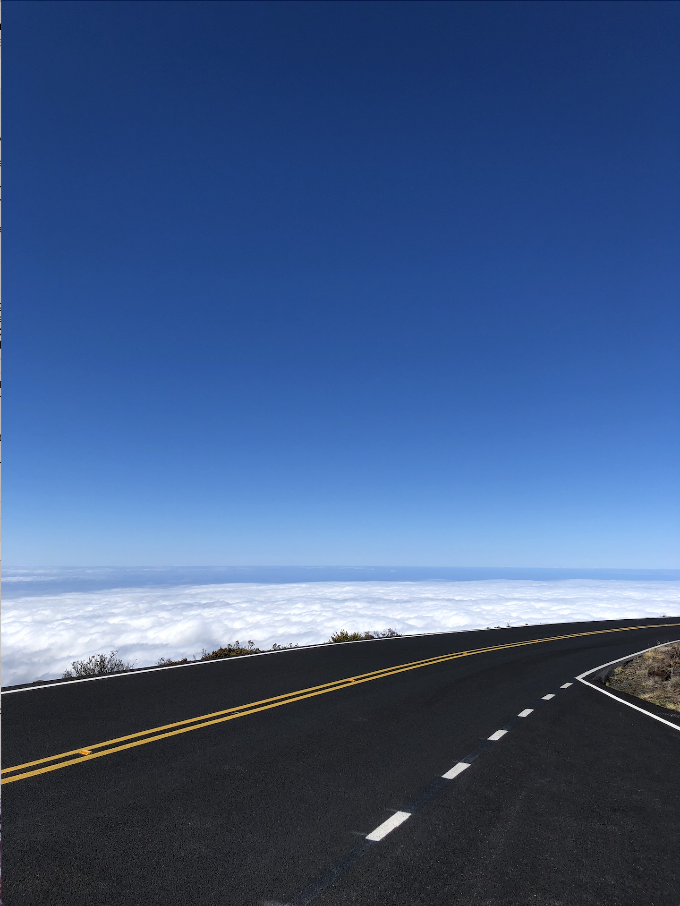

I love to travel and I love things that last long and are designed with purposes. Denim, leather are great materials that fulfill my needs and will get better with time.  

<table class="wide">
<tr>
  <td >
    
  </td>
  
</tr>
<tr>
  <td >
    

        Road in Maui    
    

  </td>
  
</tr>
<tr>
  <td >
    
  </td>

</tr>
<tr>
  <td >
    

        Glacier in Alaska    
    

  </td>
  
</tr>
<tr>
  <td >
    
  </td>
  
</tr>
<tr>
  <td >
    

        Mars! LOL    
    

  </td>
  
</tr>
</table>

---

