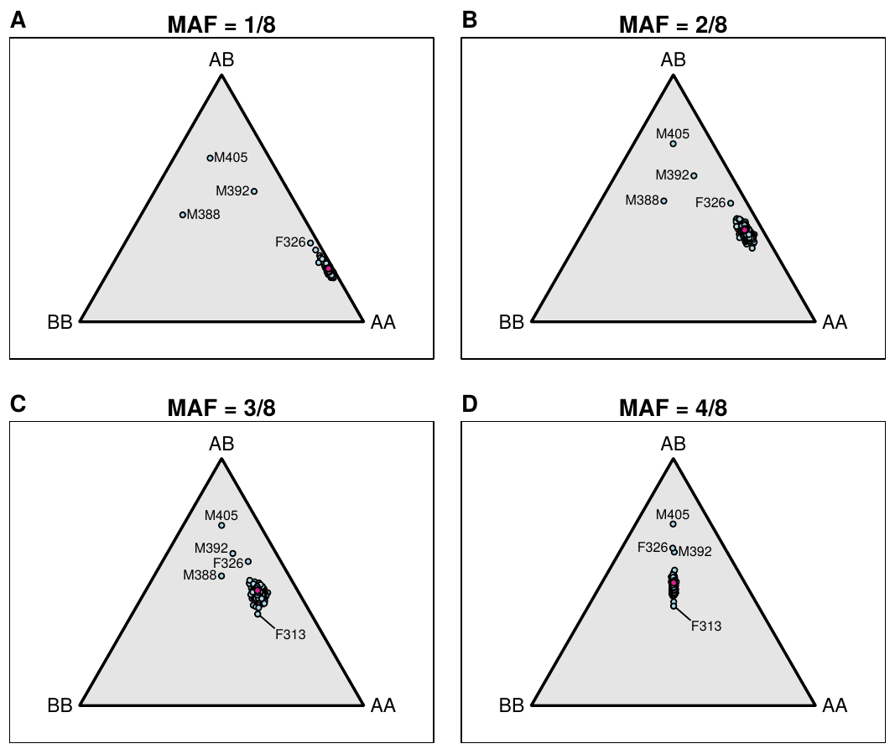

  

      <ul class="nav">
          <li><a href="iplotCorr.html">prev</a></li>
          <li><a href="samplemixups_fig7.html">next</a></li>
      </ul>
  

Broman KW, Gatti DM, Svenson KL, Sen &#346;, Churchill GA (2019)
Cleaning genotype data from Diversity Outbred mice.
[G3](https://g3journal.org) 9:1571-1579

**Figure 4**. &mdash; SNP genotype frequencies by mouse, for SNPs
split by their minor allele frequency (MAF) in the eight founder
strains. Trinomial probabilities are represented by points in an
equilateral triangle using the distances to the three sides. Pink
points indicate the expected distributions.
